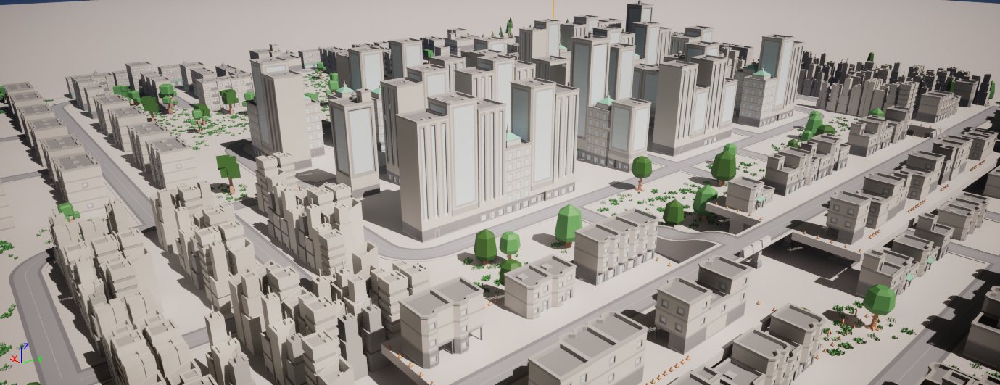

# UE5 - Traffic Game

A small playground to play with UE5 and its vehicles 🚗

- [Description](#description)
- [Requirements](#requirements)
- [Inspiration](#inspiration)
- [Download](#download)
- [Used assets](#used-assets)
- [Engine Version](#engine-version)
- [Bugs and problems](#bugs-and-problems)
- [How does it work / How can I use it / How can I edit it](#how-does-it-work--how-can-i-use-it--how-can-i-edit-it)

## Description

This is a small project used as example about how to use Unreal Engine vehicles, and as playground to try Unreal Engine 5 with Nanite, Lumen, and the new Chaos physics and its tools.

It's inspired by Epic Vehicle Template of UE5, which is BP only and which is still included and untouched in this project. All right reserved to Epic for that Starting Content.

You can use it as you wish: play it, edit it, add or edit levels or vehicles, or just take something to use on your own project.

### Requirements

Any PC that can run Unreal Engine 5 can run this project and this game, but it could be a little laggy, it's not made to be super optimized, specially regarding the rendering in the big map. Static Lightning is disabeld to save (baking) time and space.

If you want to edit the source code and/or build the project obviously you will need the standard Unreal Engine C++ configuration with either Visual Studio or CLang.

I have not uploaded Editor Binaries yet because I don't think they are needed, if you absolutelly want just the Editor to play with it and BP feel free to ask for them.

## Inspiration

In this small game you create your own traffic: every round you have to drive from a point to another, and in every round all your previous vehicles keep doing that same path, so you have to avoid yourself.

It's inspired by the game [Does Not Commute - mediocre](https://www.mediocre.se/commute/), I find it a very nice idea.

Or you can just drive around if you like to.

## Download

You can download the latest build in the [releases](https://github.com/ScrappyCocco/UETrafficGame/releases) section.

I provide both a Development and a Shipping version, the Development is useful if you want to cheat or change some stuff using CVars.

## Used assets

All assets used are free to use under the Creative Commons CC0 license.

You can find a summary of the used in the [ASSETS](ASSETS.md) file.

## Engine Version

I did this project on Unreal Engine 5.1.x, standard version installed from the Epic Launcher.

I will consider updating it to new Unreal Versions when they come out, keeping a branch for every old version so it's always acccessible.

To see the current engine version check the [uproject file](TrafficGame/TrafficGame.uproject).

## Bugs and problems

The game is not perfect, and it probably still have many problems related to vehicle physics and its replay. If you find a game-breaking bug or want to discuss something feel free to open an Issue or a Discussion.

## How does it work / How can I use it / How can I edit it

I wrote a little documentation about how you can edit the project or take something from it in the [Wiki](https://github.com/ScrappyCocco/UETrafficGame/wiki).

If you don't find what are you looking for feel free to open an Issue or a Discussion and ask!
